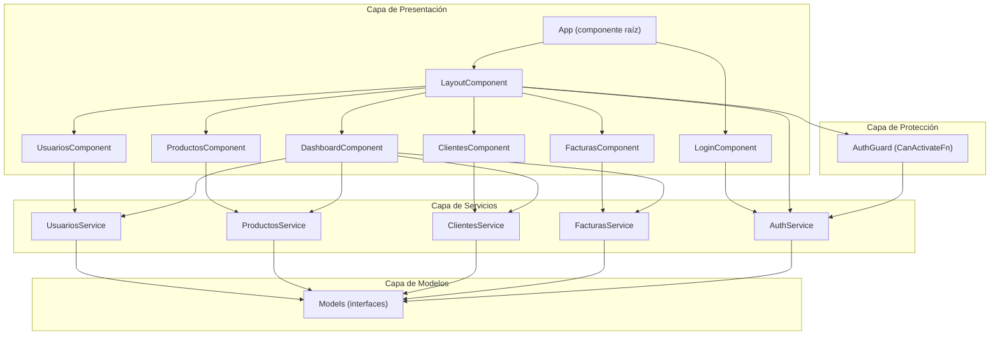
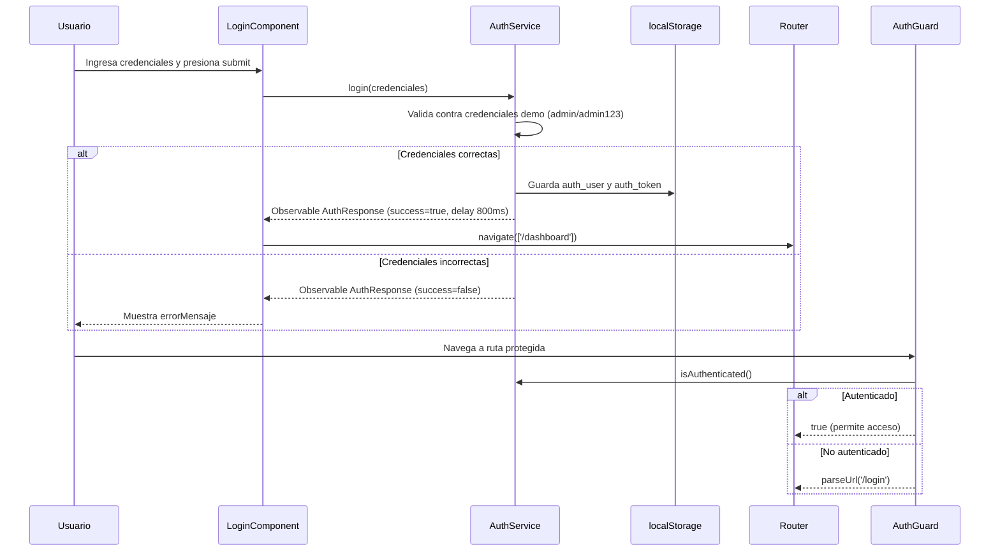
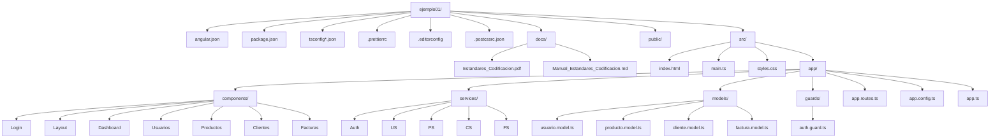
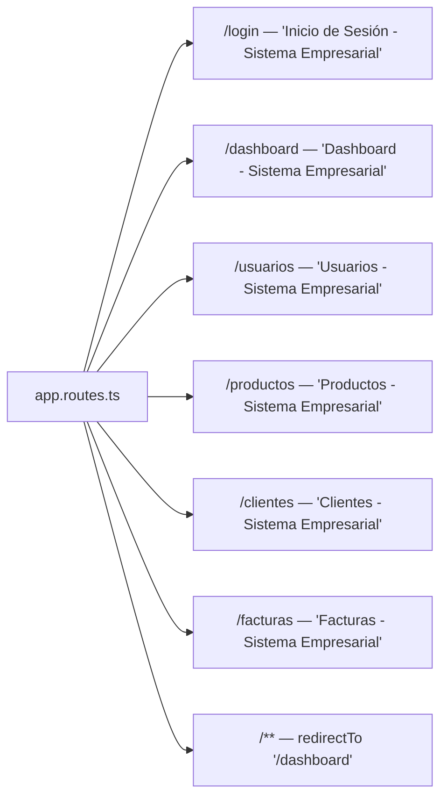
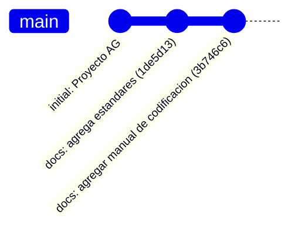
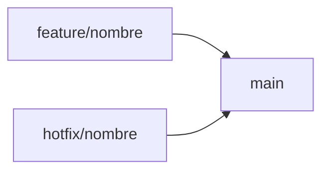

# Manual de Estándares de Codificación del Proyecto

---

**Proyecto:** ejemplo01 — Sistema de Gestión Empresarial (SGE)  
**Versión del documento:** 2.0  
**Fecha de emisión:** 03/08/2026  
**Elaborado por:** Jackson Darley Montoya Mercado  
**Institución:** SENA — Servicio Nacional de Aprendizaje  
**Ficha:** 3118526

---

## Control de versiones

| Versión | Fecha | Autor | Descripción |
|---------|-------|-------|-------------|
| 1.0 | 03/08/2026 | Jackson Darley Montoya Mercado | Versión inicial del manual de estándares. |
| 2.0 | 03/08/2026 | Jackson Darley Montoya Mercado | Reescritura completa: auditoría contra el código real, nuevas secciones de arquitectura, calidad, seguridad, rendimiento y git. |

---

## Tabla de contenido

1. [Introducción](#1-introducción)
2. [Objetivos](#2-objetivos)
3. [Alcance](#3-alcance)
4. [Arquitectura del proyecto](#4-arquitectura-del-proyecto)
5. [Organización del proyecto](#5-organización-del-proyecto)
6. [Convenciones de nomenclatura](#6-convenciones-de-nomenclatura)
7. [Estándares para componentes](#7-estándares-para-componentes)
8. [Estándares para servicios](#8-estándares-para-servicios)
9. [Estándares para modelos](#9-estándares-para-modelos)
10. [Estándares para guards](#10-estándares-para-guards)
11. [Routing](#11-routing)
12. [Formularios](#12-formularios)
13. [Buenas prácticas TypeScript](#13-buenas-prácticas-typescript)
14. [Buenas prácticas Angular](#14-buenas-prácticas-angular)
15. [Buenas prácticas RxJS](#15-buenas-prácticas-rxjs)
16. [Angular Material](#16-angular-material)
17. [Tailwind CSS](#17-tailwind-css)
18. [Calidad del código](#18-calidad-del-código)
19. [Clean Code](#19-clean-code)
20. [SOLID](#20-solid)
21. [DRY](#21-dry)
22. [KISS](#22-kiss)
23. [Seguridad](#23-seguridad)
24. [Rendimiento](#24-rendimiento)
25. [Accesibilidad](#25-accesibilidad)
26. [Git](#26-git)
27. [Convenciones de commits](#27-convenciones-de-commits)
28. [Estrategia de ramas](#28-estrategia-de-ramas)
29. [Pull Requests](#29-pull-requests)
30. [Revisión de código](#30-revisión-de-código)
31. [Checklist antes de integrar cambios](#31-checklist-antes-de-integrar-cambios)
32. [Glosario](#32-glosario)
33. [Referencias](#33-referencias)
34. [Conclusiones](#34-conclusiones)
35. [Recomendaciones futuras](#35-recomendaciones-futuras)

---

## 1. Introducción

El presente documento establece los estándares de codificación oficiales del proyecto **ejemplo01**, un sistema de gestión empresarial desarrollado con **Angular 22** sobre **TypeScript**. El manual ha sido elaborado a partir de una **auditoría completa del código fuente real**, de modo que cada norma documentada refleja las convenciones, patrones y decisiones técnicas que el proyecto ya utiliza o que debería adoptar para su evolución.

Este documento es de aplicación obligatoria para todo desarrollador que realice cambios en el repositorio y sirve como guía oficial de desarrollo, revisión de código e incorporación de nuevos miembros al equipo.

## 2. Objetivos

- Garantizar la uniformidad del código fuente en todo el repositorio.
- Reducir la curva de aprendizaje de nuevos desarrolladores.
- Facilitar las revisiones de código mediante criterios objetivos.
- Documentar las decisiones arquitectónicas actuales del proyecto.
- Establecer un marco de calidad basado en principios de ingeniería de software.
- Servir como referencia oficial para la evolución futura del sistema.

## 3. Alcance

El manual aplica a la totalidad del código fuente del proyecto, incluyendo:

- Componentes (`src/app/components/`)
- Servicios (`src/app/services/`)
- Modelos (`src/app/models/`)
- Guardas (`src/app/guards/`)
- Rutas (`src/app/app.routes.ts`)
- Configuración de la aplicación (`src/app/app.config.ts`)
- Punto de entrada (`src/main.ts`)
- Estilos globales (`src/styles.css`)
- Configuración del proyecto (`angular.json`, `tsconfig*.json`, `.prettierrc`, `.editorconfig`, `.postcssrc.json`)

> **Nota:** El proyecto es una aplicación 100 % frontend con datos simulados (mock). No utiliza backend, base de datos ni autenticación real por el momento. Cualquier referencia a estas tecnologías debe tratarse como recomendación futura, nunca como práctica existente.

## 4. Arquitectura del proyecto

El proyecto utiliza la **arquitectura standalone** de Angular (sin NgModules), con bootstrap directo de la aplicación y carga perezosa (lazy loading) en todas las rutas.



### 4.1 Flujo de autenticación



### 4.2 Decisiones de diseño

| Decisión | Justificación |
|----------|---------------|
| Componentes standalone | Elimina NgModules innecesarios; simplifica imports y el árbol de dependencias. |
| Lazy loading con `loadComponent` | Reduce el bundle inicial; solo se carga el código de la ruta visitada. |
| Signals para estado reactivo | API moderna de Angular; evita la complejidad de Zone.js para estado local. |
| Inyección con `inject()` | Patrón funcional recomendado por Angular para componentes y guardas. |
| Servicios mock con `Observable.of()` | Permite simular latencia de red y mantener la interfaz de datos lista para un futuro `HttpClient`. |
| Barriles (barrel files) | Centralizan las exportaciones y simplifican las rutas de importación. |

## 5. Organización del proyecto

La estructura de directorios del repositorio es la siguiente:



### 5.1 Responsabilidades por carpeta

| Carpeta | Responsabilidad |
|---------|-----------------|
| `src/app/components/` | Componentes de presentación. Un componente por funcionalidad de negocio. |
| `src/app/services/` | Lógica de acceso a datos y reglas de negocio. Actualmente simula una API REST. |
| `src/app/models/` | Interfaces TypeScript que modelan las entidades del dominio del sistema. |
| `src/app/guards/` | Funciones de protección de rutas (autenticación). |
| `docs/` | Documentación oficial del proyecto. |
| `public/` | Archivos estáticos servidos en la raíz (`favicon.ico`). |

> **Advertencia:** Existe una carpeta `ejemplo01/` duplicada en la raíz del repositorio que **no está rastreada por Git** (`git ls-files ejemplo01` no devuelve resultados). Debe eliminarse o ignorarse explícitamente para evitar confusión.

## 6. Convenciones de nomenclatura

Las siguientes convenciones han sido verificadas contra el código real del proyecto.

| Elemento | Convención | Ejemplo real |
|----------|-----------|--------------|
| Interfaces y tipos | PascalCase | `Usuario`, `AuthResponse`, `EstadoFactura` |
| Componentes | PascalCase + sufijo `Component` | `LoginComponent`, `UsuariosComponent` |
| Servicios | PascalCase + sufijo `Service` | `AuthService`, `FacturasService` |
| Guardas | camelCase + sufijo `Guard` | `authGuard` |
| Métodos | camelCase | `obtenerTodos()`, `toggleSidebar()` |
| Propiedades privadas | `private readonly` + camelCase | `private readonly mockUsuarios` |
| Signales | camelCase, **sin prefijo** `$` | `usuarioActual`, `sidebarCollapsed`, `cargando` |
| Variables inyectadas | camelCase + sufijo `Service` | `private usuariosService = inject(UsuariosService)` |
| Constantes de módulo | UPPER_SNAKE_CASE | `FICHA_SENA`, `TECNOLOGIAS` (en el script generador) |
| Archivos y carpetas | kebab-case | `usuario.model.ts`, `login.component.ts` |

### Ejemplos

✔ Correcto

```typescript
export interface Usuario {
  id: number;
  nombre: string;
}
```

✘ Incorrecto

```typescript
export interface usuario {
  ID: number;
  nombre_completo: string;
}
```

✔ Correcto

```typescript
private usuariosService = inject(UsuariosService);
usuariosFiltrados = signal<Usuario[]>([]);
```

✘ Incorrecto

```typescript
private _service = inject(UsuariosService);
$usuariosFiltrados = signal<Usuario[]>([]);
```

## 7. Estándares para componentes

### 7.1 Arquitectura

Todos los componentes deben ser **standalone**.

✔ Correcto

```typescript
@Component({
  selector: 'app-usuarios',
  standalone: true,
  imports: [CommonModule, FormsModule],
  templateUrl: './usuarios.component.html',
  styleUrls: ['./usuarios.component.css']
})
```

✘ Incorrecto

```typescript
@NgModule({
  declarations: [UsuariosComponent]
})
```

### 7.2 Tamaño máximo

Si un componente supera las **200 líneas**, debe separarse en archivos: `.ts` (lógica), `.html` (template) y `.css` (estilos).

**Estado actual:** Los siguientes componentes superan el umbral y deben refactorizarse en fases futuras.

| Componente | Líneas | Acción recomendada |
|-----------|--------|-------------------|
| `DashboardComponent` | 464 | Extraer template y estilos |
| `LayoutComponent` | 398 | Extraer template y estilos |
| `UsuariosComponent` | 384 | Extraer estilos |
| `LoginComponent` | 354 | Extraer estilos |
| `ProductosComponent` | 237 | Extraer estilos |

### 7.3 Patrón de listado

Todos los listados del proyecto siguen el mismo patrón: señal `cargando`, señal filtrada y método `buscar()`.

✔ Correcto (patrón real de `UsuariosComponent`)

```typescript
export class UsuariosComponent implements OnInit {
  private usuariosService = inject(UsuariosService);

  usuarios: Usuario[] = [];
  usuariosFiltrados = signal<Usuario[]>([]);
  terminoBusqueda = '';
  cargando = signal(true);

  ngOnInit(): void {
    this.cargarUsuarios();
  }

  private cargarUsuarios(): void {
    this.cargando.set(true);
    this.usuariosService.obtenerTodos().subscribe({
      next: (data) => {
        this.usuarios = data;
        this.usuariosFiltrados.set(data);
        this.cargando.set(false);
      },
      error: () => this.cargando.set(false)
    });
  }

  buscar(): void {
    const termino = this.terminoBusqueda.toLowerCase().trim();
    if (!termino) {
      this.usuariosFiltrados.set(this.usuarios);
      return;
    }
    const filtrados = this.usuarios.filter(u =>
      u.nombre.toLowerCase().includes(termino) ||
      u.email.toLowerCase().includes(termino)
    );
    this.usuariosFiltrados.set(filtrados);
  }
}
```

### 7.4 Control de flujo

Se debe usar la sintaxis de control de flujo nativa de Angular (`@if`, `@for`, `@empty`). Prohibido `*ngIf` y `*ngFor` para código nuevo.

✔ Correcto (extraído de `usuarios.component.ts`)

```html
@for (usuario of usuariosFiltrados(); track usuario.id) {
  <tr>
    <td>{{ usuario.nombre }}</td>
  </tr>
} @empty {
  <tr>
    <td colspan="7" class="empty-state">
      <p>No se encontraron usuarios</p>
    </td>
  </tr>
}
```

✘ Incorrecto

```html
<tr *ngFor="let usuario of usuariosFiltrados()">
  <td>{{ usuario.nombre }}</td>
</tr>
```

### 7.5 `track` en listas

Toda iteración con `@for` debe especificar `track` con un identificador único.

✔ Correcto

```html
@for (producto of productosFiltrados(); track producto.id) { ... }
@for (item of menuItems; track item.ruta) { ... }
```

✘ Incorrecto

```html
@for (producto of productosFiltrados(); track $index) { ... }
```

## 8. Estándares para servicios

### 8.1 Definición

Todos los servicios deben declararse con `@Injectable({ providedIn: 'root' })` y exportarse a través del barril `services/index.ts`.

✔ Correcto

```typescript
@Injectable({
  providedIn: 'root'
})
export class UsuariosService {
  // ...
}
```

✘ Incorrecto

```typescript
@Injectable()
export class UsuariosService {
  // requeriría registro manual en NgModule
}
```

### 8.2 Interfaz CRUD uniforme

Los servicios de negocio deben implementar exactamente las siguientes firmas:

```typescript
export class XService {
  obtenerTodos(): Observable<Modelo[]>;
  obtenerPorId(id: number): Observable<Modelo | undefined>;
  crear(entity: Omit<Modelo, 'id'>): Observable<Modelo>;
  actualizar(entity: Modelo): Observable<Modelo>;
  eliminar(id: number): Observable<boolean>;
}
```

✔ Correcto (verificado en los 4 servicios de negocio)

```typescript
crear(usuario: Omit<Usuario, 'id'>): Observable<Usuario> {
  const nuevoUsuario: Usuario = {
    ...usuario,
    id: Math.max(...this.mockUsuarios.map(u => u.id)) + 1
  };
  return of(nuevoUsuario).pipe(delay(500));
}
```

✘ Incorrecto

```typescript
crear(usuario: any): Observable<Usuario> {
  return of(usuario).pipe(delay(1000));
}
```

### 8.3 Simulación de latencia

El proyecto estandariza los siguientes retardos simulados:

| Operación | Retardo aplicado | Ejemplo |
|-----------|-----------------|---------|
| Lista completa | 500 ms | `obtenerTodos()` |
| Búsqueda por ID | 300 ms | `obtenerPorId(id)` |
| Autenticación | 800 ms | `login(credenciales)` |
| Operaciones CRUD | 500 ms | `crear`, `actualizar` |
| Eliminación | 300 ms | `eliminar(id)` |

**Recomendación:** Definir estas latencias como constantes tipadas en un futuro archivo `services/latency.constants.ts`.

### 8.4 Tipado estricto de parámetros

Se debe tipar correctamente cada parámetro. En particular, los estados de factura deben usar el tipo `EstadoFactura`, no `string`.

✔ Correcto

```typescript
actualizarEstado(id: number, estado: EstadoFactura): Observable<boolean>
```

✘ Incorrecto (código actual que debe corregirse)

```typescript
actualizarEstado(id: number, estado: string): Observable<boolean>
```

## 9. Estándares para modelos

### 9.1 Interfaces con documentación

Toda interfaz debe tener documentación `@property` por campo.

✔ Correcto (extraído de `usuario.model.ts`)

```typescript
/**
 * @property id - Identificador numérico único del usuario
 * @property nombre - Nombre completo del usuario
 * @property email - Correo electrónico corporativo
 */
export interface Usuario {
  id: number;
  nombre: string;
  email: string;
}
```

✘ Incorrecto

```typescript
export interface Usuario {
  id: number;
  nombre: string;
}
```

### 9.2 Tipos unión para estados

Los estados de una entidad deben modelarse como unión de literales de cadena.

✔ Correcto (extraído de `factura.model.ts`)

```typescript
export type EstadoFactura = 'PENDIENTE' | 'PAGADA' | 'ANULADA' | 'VENCIDA';
```

✘ Incorrecto

```typescript
export type EstadoFactura = string;
```

### 9.3 Composición sobre herencia

Los modelos deben reutilizar interfaces mediante composición.

✔ Correcto (extraído de `factura.model.ts`)

```typescript
export interface Factura {
  cliente: Cliente;
  detalles: DetalleFactura[];
  // ...
}
```

### 9.4 Barriles

Los modelos se re-exportan a través de `models/index.ts`. Los componentes importan **solo** desde el barril.

✔ Correcto

```typescript
import { Usuario, Credenciales, AuthResponse } from '../models';
```

✘ Incorrecto

```typescript
import { Usuario } from '../models/usuario.model';
import { Credenciales } from '../models/usuario.model';
```

## 10. Estándares para guards

Las guardas deben implementarse como **funciones** (`CanActivateFn`), no como clases.

✔ Correcto (extraído de `auth.guard.ts`)

```typescript
export const authGuard: CanActivateFn = (): boolean | UrlTree => {
  const authService = inject(AuthService);
  const router = inject(Router);

  if (authService.isAuthenticated()) {
    return true;
  }

  return router.parseUrl('/login');
};
```

✘ Incorrecto

```typescript
@Injectable()
export class AuthGuard implements CanActivate {
  constructor(private authService: AuthService) {}
  canActivate(): boolean { ... }
}
```

### Reglas aplicables

- Usar `inject()` dentro de la función guard para obtener dependencias.
- Retornar `true` para permitir el acceso.
- Retornar `UrlTree` con `router.parseUrl()` para redirigir.
- Verificar el estado de autenticación mediante la señal `isAuthenticated()` del servicio.

## 11. Routing

### 11.1 Carga perezosa obligatoria

Toda ruta debe usar `loadComponent` con import dinámico. Prohibido `component:` directo en rutas.

✔ Correcto (extraído de `app.routes.ts`)

```typescript
{
  path: 'dashboard',
  loadComponent: () =>
    import('./components/dashboard/dashboard.component').then(m => m.DashboardComponent),
  title: 'Dashboard - Sistema Empresarial'
}
```

✘ Incorrecto

```typescript
{
  path: 'dashboard',
  component: DashboardComponent
}
```

### 11.2 Títulos de página

Toda ruta debe definir la propiedad `title`.



### 11.3 Protección de rutas

Las rutas protegidas se agrupan como hijas del `LayoutComponent`, protegidas por el `authGuard` en el padre. La ruta `/login` permanece pública.

✔ Correcto (extraído de `app.routes.ts`)

```typescript
{
  path: '',
  canActivate: [authGuard],
  loadComponent: () =>
    import('./components/layout/layout.component').then(m => m.LayoutComponent),
  children: [ /* rutas hijas del dashboard */ ]
}
```

## 12. Formularios

El proyecto utiliza **formularios template-driven** con `FormsModule` y `ngModel`.

✔ Correcto (extraído de `login.component.ts`)

```html
<form (ngSubmit)="onSubmit()" class="login-form">
  <input
    id="usuario"
    type="text"
    [(ngModel)]="credenciales.usuario"
    name="usuario"
    required
    autocomplete="username"
  />
</form>
```

✘ Incorrecto

```html
<form>
  <input [(value)]="credenciales.usuario" />
</form>
```

### Reglas aplicables

- Todo control con `ngModel` debe definir `name`.
- Los formularios de login deben incluir `autocomplete`.
- Validar en el método `onSubmit()` y mostrar `errorMensaje`.

> **Nota:** No se usa `ReactiveFormsModule` en el código actual. Los formularios reactivos (`FormGroup`, `FormControl`) se consideran una **recomendación futura** para formularios complejos (creación/edición de entidades).

## 13. Buenas prácticas TypeScript

### 13.1 Modo estricto

El proyecto usa estrictas opciones del compilador en `tsconfig.json`. **No deben desactivarse.**

| Opción | Valor actual |
|--------|-------------|
| `noImplicitOverride` | `true` |
| `noPropertyAccessFromIndexSignature` | `true` |
| `noImplicitReturns` | `true` |
| `noFallthroughCasesInSwitch` | `true` |
| `isolatedModules` | `true` |
| `experimentalDecorators` | `true` |
| `target` | `ES2022` |

### 13.2 Tipado explícito

✔ Correcto

```typescript
private mockUsuarios: Usuario[] = [ /* ... */ ];
credenciales: Credenciales = { usuario: '', contrasena: '' };
```

✘ Incorrecto

```typescript
private mockUsuarios = [];
credenciales = {};
```

### 13.3 `readonly` en datos inmutables

Los datos estáticos mock deben declararse como `private readonly`.

✔ Correcto

```typescript
private readonly mockProductos: Producto[] = [];
```

✘ Incorrecto

```typescript
private mockProductos: Producto[] = [];
```

### 13.4 `Omit<T, 'id'>` en creación

Las operaciones de creación reciben la entidad **sin** el campo `id`, que se autoasigna en el servicio.

✔ Correcto

```typescript
crear(cliente: Omit<Cliente, 'id'>): Observable<Cliente>
```

✘ Incorrecto

```typescript
crear(cliente: Cliente): Observable<Cliente>
```

## 14. Buenas prácticas Angular

### 14.1 Inyección de dependencias

Usar exclusivamente `inject()`. No iniciar dependencias en el constructor.

✔ Correcto

```typescript
private facturasService = inject(FacturasService);
private router = inject(Router);
```

✘ Incorrecto

```typescript
constructor(private facturasService: FacturasService) {}
```

### 14.2 Señales (Signals)

Usar `signal()` y `computed()` para el estado reactivo local.

✔ Correcto (extraído de `auth.service.ts` y `layout.component.ts`)

```typescript
private usuarioActual = signal<Usuario | null>(null);
readonly isAuthenticated = computed(() => this.usuarioActual() !== null);
sidebarCollapsed = signal(false);
```

✘ Incorrecto

```typescript
private usuarioActual = new BehaviorSubject<Usuario | null>(null);
sidebarCollapsed = false;  // sin reactividad
```

### 14.3 Recuperación de datos en servicios

Exponer siempre `Observable` desde los servicios; suscribirse en los componentes.

✔ Correcto

```typescript
obtenerTodos(): Observable<Usuario[]> {
  return of([...this.mockUsuarios]).pipe(delay(500));
}
```

### 14.4 Barriles

Importar modelos y servicios únicamente desde los barriles `index.ts`.

## 15. Buenas prácticas RxJS

### 15.1 Suscripciones

Toda suscripción debe usar el objeto `{ next, error }`.

✔ Correcto

```typescript
this.authService.login(this.credenciales).subscribe({
  next: (respuesta) => {
    this.cargando = false;
    if (respuesta.success) {
      this.router.navigate(['/dashboard']);
    }
  },
  error: () => {
    this.cargando = false;
    this.errorMensaje = 'Error de conexión. Intente nuevamente.';
  }
});
```

✘ Incorrecto

```typescript
this.authService.login(this.credenciales).subscribe(respuesta => {
  this.router.navigate(['/dashboard']);
});
```

### 15.2 Manejo de errores

Toda suscripción debe proporcionar un handler `error`. El componente `LoginComponent` es el único que cumple esta regla actualmente; los listados deben corregirse.

✔ Correcto

```typescript
.subscribe({
  next: (data) => { /* ... */ },
  error: () => { /* log o feedback al usuario */ }
});
```

✘ Incorrecto (estado actual en los 4 listados)

```typescript
.subscribe({
  next: (data) => { /* ... */ },
  error: () => this.cargando.set(false)
});
```

> **Nota:** Los observables actuales provienen de `of()` y no producen errores en la práctica. Sin embargo, el handler `error` es obligatorio para preparar la migración a `HttpClient`.

> **Recomendación futura:** Usar `takeUntilDestroyed()` cuando se introduzcan streams infinitos o suscripciones persistentes.

## 16. Angular Material

**Estado actual:** `@angular/material` y `@angular/cdk` están instalados y `styles.css` contiene reglas de personalización para sus componentes (`.mat-toolbar`, `.mat-mdc-card`, `.mat-mdc-header-row`, `.mat-mdc-form-field`). Sin embargo, **ningún template importa o utiliza componentes de Angular Material** actualmente.

### Regla aplicable

- **No** es obligatorio usar Angular Material. Los componentes de UI del proyecto son HTML/CSS nativos personalizados.
- Las reglas CSS existentes en `styles.css` se conservan para preparar su adopción.

### Recomendación futura

Si se adoptan componentes Material, deberá definirse un tema oficial (indigo `#1a237e`, teal `#00897b`, rojo `#d32f2f`) y documentar su uso en una nueva sección del manual.

## 17. Tailwind CSS

**Estado actual:** Tailwind 4 está configurado (`@import "tailwindcss"` en `styles.css`, plugin en `.postcssrc.json`). Los templates **no utilizan clases utilitarias**; todo el estilo se basa en CSS scoped personalizado por componente.

### Regla aplicable

- **No** introducir clases utilitarias de Tailwind en templates sin aprobación de revisión.
- Mantener la consistencia con el sistema de estilos actual: CSS scoped en el componente o estilos globales en `styles.css`.

### Recomendación futura

Adoptar gradativamente Tailwind para utilidades puntuales (layout, espaciado, responsive) pero definiendo primero una guía de tokens de diseño.

## 18. Calidad del código

### 18.1 Formato

| Regla | Configuración |
|-------|--------------|
| Indentación | 2 espacios |
| Comillas | Simples |
| Ancho de línea | 100 columnas |
| Salto de línea final | Obligatorio |
| Espacios al final de línea | Prohibidos |

Fuentes de verdad: `.prettierrc` y `.editorconfig`.

### 18.2 Documentación interna

Todo archivo fuente (componente, servicio, modelo, guard, ruta) debe iniciar con un banner descriptivo.

✔ Correcto (extraído de `productos.service.ts`)

```typescript
/**
 * ============================================================
 * SERVICIO: ProductosService
 * ============================================================
 * Proposito: Servicio que simula (Mock) las operaciones CRUD
 * para la gestion del inventario de productos.
 * ============================================================
 */
```

✘ Incorrecto

```typescript
// Servicio de productos
```

### 18.3 Idioma

Todo el código (identificadores, comentarios, mensajes UI) se escribe en **español**.

✔ Correcto: `cargarUsuarios()`, `errorMensaje`, `'Por favor ingrese usuario y contraseña'`
✘ Incorrecto: `loadUsers()`, `errorMessage`, `'Please enter your credentials'`

## 19. Clean Code

- **Nombres descriptivos:** los métodos dicen qué hacen (`obtenerTodos()`, `toggleSidebar()`, `cerrarSesion()`).
- **Funciones pequeñas:** cada método tiene una única responsabilidad (`cargarDatos()`, `actualizarTarjetas()`, `buscar()`).
- **Sin magia:** los datos mock documentan su propósito con comentarios.
- **Legibilidad:** los templates usan clases con nombres semánticos (`login-card`, `stat-card`, `table-container`).

✔ Correcto

```typescript
private cargarSesion(): void {
  if (isPlatformBrowser(this.platformId)) {
    const sesionGuardada = localStorage.getItem('auth_user');
    if (sesionGuardada) {
      try {
        this.usuarioActual.set(JSON.parse(sesionGuardada));
      } catch {
        localStorage.removeItem('auth_user');
      }
    }
  }
}
```

✘ Incorrecto

```typescript
getSes() {
  if (window !== undefined) {
    this.us.set(JSON.parse(localStorage.getItem('auth_user') || ''));
  }
}
```

## 20. SOLID

| Principio | Aplicación en el proyecto |
|-----------|--------------------------|
| **S** — Responsabilidad única | Cada servicio gestiona una sola entidad (`UsuariosService` → usuarios). |
| **O** — Abierto/Cerrado | Los modelos extienden comportamiento mediante composición, no modificación. |
| **L** — Sustitución | Las interfaces tipan contratos; los servicios devuelven exactamente el modelo. |
| **I** — Segregación | Los componentes consumen solo los métodos que necesitan. |
| **D** — Inversión | Los componentes dependen de servicios, no de implementaciones concretas. |

### Recomendación

Para reforzar **D**, considerar definir una interfaz de contrato por servicio (ej. `CrudService<T>`) que abstraiga las operaciones CRUD y permita reemplazar el mock por `HttpClient` sin tocar los componentes.

## 21. DRY (Don't Repeat Yourself)

**Hallazgo real:** Existe duplicidad verificada en el proyecto:

1. **Estilos copiados:** los componentes `productos`, `clientes` y `facturas` comparten bloques CSS idénticos (`.page`, `.btn-primary`, `.table`, `.badge`, `.spinner`, etc.).
2. **Patrón `cargar`:** se repite en los 4 listados con la misma estructura.
3. **Patrón `buscar`:** filtrado con `toLowerCase().includes()` repetido.

### Plan de corrección

- Centralizar las clases comunes (tablas, botones, badges, estados vacíos, loader) en `styles.css`.
- Evaluar la creación de una utilidad o función compartida para la carga y filtrado de listados.

## 22. KISS (Keep It Simple, Stupid)

- Los servicios exponen observables pequeños y predecibles.
- Las señales simplifican el flujo de datos sin librerías de estado externas.
- El flujo de autenticación es directo y comprensible.

✔ El proyecto evita complejidad innecesaria: sin NgRx, sin servicios HTTP, sin formularios reactivos hasta que se necesiten.

## 23. Seguridad

### 23.1 Protección de rutas

Toda ruta del dashboard está protegida por `authGuard`. Verificar siempre `isAuthenticated()`.

✔ Correcto (extraído de `auth.guard.ts`)

```typescript
if (authService.isAuthenticated()) {
  return true;
}
return router.parseUrl('/login');
```

### 23.2 Persistencia segura en SSR

El acceso a `localStorage` debe protegerse con `isPlatformBrowser()`.

✔ Correcto

```typescript
if (isPlatformBrowser(this.platformId)) {
  localStorage.setItem('auth_user', JSON.stringify(this.mockUsuario));
}
```

✘ Incorrecto

```typescript
localStorage.setItem('auth_user', JSON.stringify(this.mockUsuario));
```

### 23.3 Credenciales de demostración

Las credenciales `admin` / `admin123` están hardcodeadas en `AuthService` con fines educativos. **No deben utilizarse en producción.**

> **Advertencia:** Si el sistema se conecta a un backend real, estas credenciales deben eliminarse y sustituirse por autenticación segura (tokens, hashing, HTTPS).

## 24. Rendimiento

### 24.1 Presupuestos de bundle

`angular.json` define budgets de producción: **500 kB** (advertencia) / **1 MB** (error) para el bundle inicial.

### 24.2 Carga perezosa

Todas las rutas cargan sus componentes bajo demanda, lo que reduce el bundle inicial.

### 24.3 Recomendaciones

- **Optimizar los datos mock:** los arrays internos (`mockProductos`, `mockClientes`) son fijos y se copian con spread `[...]`. Mantener esta inmutabilidad evita efectos secundarios.
- **Evitar llamadas redundantes:** `DashboardComponent` llama a los 4 servicios en `ngOnInit`; considerar `forkJoin` cuando sea necesario.
- **Pipes puros:** usar `currency` y `date` (pipes puros de Angular) ya es correcto.

## 25. Accesibilidad

### 25.1 Prácticas presentes

- `label` con atributo `for` vinculado al `id` del input en `LoginComponent`.
- `autocomplete="username"` y `autocomplete="current-password"` en el formulario de login.
- `title` en botones de icono (`title="Editar"`, `title="Eliminar"`, `title="Cerrar sesión"`).
- `lang="es"` en `index.html`.

### 25.2 Recomendaciones

- Añadir `aria-label` a los botones que solo contienen iconos.
- Asegurar contraste suficiente (verificar pares como `#1a237e` sobre blanco).
- Probar navegación con teclado en tablas y modales.

## 26. Git

### 26.1 Comandos básicos

```bash
# Ver estado del repositorio
git status

# Ver cambios realizados
git diff

# Añadir archivos al área de staging
git add <archivo>

# Crear un commit con mensaje descriptivo
git commit -m "fix: corregir validación de login"

# Subir cambios a la rama remota
git push origin main
```

### 26.2 Estado del repositorio

Historial actual (verificado):



## 27. Convenciones de commits

Los mensajes de commit deben seguir el formato:

```
<tipo>: <descripción en presente, minúsculas>
```

| Prefijo | Uso | Ejemplo |
|---------|-----|---------|
| `feat:` | Nueva funcionalidad | `feat: agregar módulo de facturación` |
| `fix:` | Corrección de errores | `fix: corregir validación de login` |
| `docs:` | Cambios en documentación | `docs: actualizar manual de estándares` |
| `refactor:` | Mejora sin cambiar comportamiento | `refactor: simplificar servicio de usuarios` |
| `style:` | Formato sin afectar lógica | `style: aplicar formato prettier` |
| `test:` | Pruebas | `test: agregar pruebas de auth` |
| `chore:` | Mantenimiento | `chore: actualizar dependencias` |

✔ Correcto

```bash
git commit -m "docs: agregar manual de estándares de codificación en carpeta docs"
```

✘ Incorrecto

```bash
git commit -m "cambios"
```

## 28. Estrategia de ramas



El proyecto trabaja directamente sobre `main` para desarrollo colaborativo. Para cambios experimentales se recomienda:

1. Crear una rama por funcionalidad: `git checkout -b feature/nombre-funcionalidad`
2. Realizar commits pequeños y descriptivos.
3. Abrir un Pull Request hacia `main`.
4. Integrar tras la aprobación del revisor.

## 29. Pull Requests

- **Descripción clara:** qué se cambia, por qué, y cómo se probó.
- **Commits atómicos:** un commit por cambio lógico.
- **Sin errores de build:** ejecutar `ng build` antes de abrir o fusionar.
- **Sin conflictos:** ejecutar `git pull --rebase origin main` antes de fusionar.

## 30. Revisión de código

### Criterios de revisión

- Cumple los estándares de nomenclatura (sección 6).
- Usa componentes standalone y lazy loading.
- Usa `inject()` y señales.
- Maneja errores en todas las suscripciones.
- No introduce duplicidad (DRY).
- Respeta los límites de tamaño de componente.
- Formato correcto con Prettier.
- Documentación con banner y `@property`.

## 31. Checklist antes de integrar cambios

- [ ] `ng build` compila sin errores.
- [ ] `ng test` pasa (cuando existan pruebas).
- [ ] Formato aplicado con Prettier.
- [ ] No hay clases utilitarias de Tailwind sin aprobación.
- [ ] No se desactivaron opciones estrictas del `tsconfig.json`.
- [ ] Toda suscripción tiene handler `error`.
- [ ] Los archivos nuevos incluyen banner de documentación.
- [ ] Se actualizó este manual si el estándar cambió.
- [ ] `git status` muestra solo los archivos intencionales.
- [ ] El commit usa el prefijo correcto.

## 32. Glosario

| Término | Definición |
|---------|-----------|
| **Standalone** | Arquitectura Angular sin NgModules que usa `imports` directamente en el componente. |
| **Signal** | Primitiva reactiva de Angular para estado (`signal()`, `computed()`). |
| **Lazy loading** | Carga diferida de código bajo demanda mediante `loadComponent`. |
| **Barrel file** | Archivo `index.ts` que re-exporta módulos y simplifica importaciones. |
| **Mock** | Datos simulados que reemplazan un servicio real de backend. |
| **Guard** | Función (`CanActivateFn`) que protege rutas en Angular Router. |
| **CRUD** | Create, Read, Update, Delete — operaciones básicas de persistencia. |

## 33. Referencias

| Tema | Referencia |
|------|-----------|
| Angular | https://angular.dev |
| Angular Signals | https://angular.dev/guide/signals |
| Angular Routing | https://angular.dev/guide/routing |
| Angular Control Flow | https://angular.dev/guide/templates/control-flow |
| Lazy Loading | https://angular.dev/guide/ngmodules/lazy-loading |
| Conventional Commits | https://www.conventionalcommits.org |
| Prettier | https://prettier.io |
| Vitest | https://vitest.dev |
| RxJS | https://rxjs.dev |

## 34. Conclusiones

El proyecto `ejemplo01` cuenta con una arquitectura Angular moderna y limpia: standalone, lazy loading, señales, inyección funcional y control de flujo nativo. La documentación interna del código es ejemplar, con banners descriptivos en todos los archivos.

Este manual establece el marco de estándares que el proyecto ya practica en su mayoría y define las correcciones necesarias: tipar correctamente los parámetros de estado, manejar errores en todas las suscripciones, separar componentes grandes, centralizar estilos duplicados y eliminar la carpeta `ejemplo01/` no rastreada.

La aplicación de este manual convierte el repositorio en una base sólida para el crecimiento del sistema, ya sea incorporando un backend real, pruebas automatizadas o nuevos módulos de negocio.

## 35. Recomendaciones futuras

Las siguientes recomendaciones **no describen el estado actual** del proyecto y solo deberán incorporarse cuando se planifique su implementación:

| Área | Recomendación |
|------|---------------|
| **Backend** | Conectar los servicios mock a una API REST con `HttpClient` e interceptores. |
| **Entornos** | Crear `environments/environment.ts` (dev) y `environment.prod.ts` para configuración por entorno. |
| **Pruebas** | Escribir pruebas unitarias con Vitest (ya configurado en `tsconfig.spec.json`) para servicios y componentes. |
| **Formularios reactivos** | Migrar a `ReactiveFormsModule` cuando existan formularios de creación/edición complejos. |
| **Manejo de errores global** | Implementar un `ErrorHandler` global y mensajes de usuario estandarizados. |
| **Componentes compartidos** | Crear una carpeta `shared/` para botones, tablas y badges reutilizables. |
| **Limpieza** | Eliminar la carpeta `ejemplo01/` duplicada y verificar `git status` limpio. |
| **Assets** | Crear `src/assets/` y añadir las imágenes referenciadas por el modelo `Producto` (`laptop.png`, `monitor.png`, etc.). |
| **Angular Material** | Adoptar componentes Material con un tema oficial cuando el sistema requiera componentes avanzados (diálogos, tablas con paginación, formularios validados). |
| **Tailwind** | Definir tokens de diseño y adoptar utilidades para layout y responsive. |

---

*Documento generado a partir de la auditoría completa del repositorio `ejemplo01`. Ficha SENA 3118526 — Autor: Jackson Darley Montoya Mercado.*